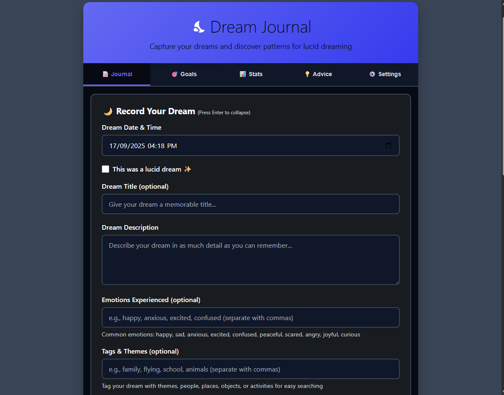

<!-- markdownlint-disable MD033 -->

<p align="center">
  
</p>

<h1 align="center">Dream Journal</h1>

<p align="center">
  <strong>Capture your dreams and discover patterns for lucid dreaming.</strong>
  <br>
  <a href="https://webdreamjournal.github.io/DreamJournal/"><strong>Live Demo »</strong></a>
</p>

<p align="center">
  
  
</p>

---

<p align="center">
  
</p>

## About The Project

Dream Journal is a privacy-focused, client-side Progressive Web App (PWA) designed for lucid dreaming enthusiasts. It provides a comprehensive suite of tools to help you record, analyze, and enhance your dreaming experience. With a focus on security and offline functionality, your dream data stays securely on your own device.

This application is built with vanilla JavaScript, HTML, and CSS, demonstrating a modern, framework-less approach to web development.

> **Note:** This project was heavily assisted by AI, primarily Claude Code and Gemini Jules, in its development.

## 🚀 Installation

There are two ways to use Dream Journal: by installing it as a PWA for the best experience, or by running it locally for development.

### As a Web App (PWA)

This is the recommended way to use the app. You can install Dream Journal directly from your browser on supported platforms (like Chrome and Edge on Desktop and Mobile).

1.  Navigate to the **[Live Demo](https://webdreamjournal.github.io/DreamJournal/)**.
2.  Look for the "Install" icon in your browser's address bar.
3.  Click it and follow the prompts to add Dream Journal to your device.

This will install the app so you can run it from your home screen or desktop, and it enables full offline functionality.

### For Local Development

To get a local copy up and running for development purposes, follow these simple steps.

**Prerequisites:**
You need a modern web browser and a way to run a local web server. Python is an easy option if you have it installed.

**Setup:**
1.  Clone the repo:
    ```sh
    git clone https://github.com/Webdreamjournal/DreamJournal.git
    ```
2.  Navigate to the project directory:
    ```sh
    cd DreamJournal
    ```
3.  Serve the files with a local web server.
    *   If you have Python 3: `python -m http.server`
    *   If you have Python 2: `python -m SimpleHTTPServer`
4.  Open your browser and navigate to `http://localhost:8000` (or the port specified by your server).

## Key Features

*   **🌙 Complete Dream Journaling:** Record your dreams with titles, descriptions, dates, emotions, tags, and dream signs.
*   **🔒 Privacy First:** All data is stored locally on your device. Nothing is ever sent to a server.
*   **🔐 Robust Security:**
    *   **PIN Protection:** Secure your journal with a 4-6 digit PIN.
    *   **Client-Side Encryption:** Opt-in to encrypt your entire journal with a password using the Web Crypto API (AES-256-GCM).
    *   **Secure Recovery:** Multiple PIN recovery options (dream title verification, 72-hour timer) and a secure data-wipe option for forgotten encryption passwords.
*   **📱 Progressive Web App (PWA):** Installable on desktop and mobile devices for a native-app-like experience.
*   **✈️ Offline Functionality:** Works completely offline thanks to a robust service worker implementation.
*   **🎯 Goal Tracking:** Set and track your lucid dreaming goals, with automatic progress calculation for streaks, lucid dream counts, and more.
*   **📊 In-depth Statistics:** Visualize your dreaming patterns with an interactive calendar, charts, and detailed stats for monthly, yearly, and lifetime progress.
*   **💡 Daily Advice:** Access a rich database of over 375 categorized tips on lucid dreaming techniques, sleep hygiene, and more.
*   **☁️ Dream Sign Analysis:** Discover your most common dream signs with a word cloud and track their effectiveness at triggering lucidity.
*   **🎤 Voice Notes:** Record voice memos of your dreams for quick and easy capture.
*   **🔄 Import & Export:** Easily back up and restore your dream data.
*   **🎨 Light & Dark Themes:** Choose the theme that's easiest on your eyes.
*   **♿ Accessibility Ready:** Built with accessibility in mind, including ARIA attributes and screen reader support.

## Technology Stack

This project is built with a focus on modern, framework-less web technologies.

*   **Frontend:**
    *   Vanilla JavaScript (ES6+ Modules)
    *   HTML5
    *   CSS3
*   **Storage:**
    *   IndexedDB (for primary data storage)
    *   Local Storage (for settings and fallback)
*   **APIs:**
    *   Web Crypto API (for client-side encryption)
    *   Service Worker API (for PWA and offline functionality)
    *   MediaRecorder API (for voice notes)

## License

Distributed under the GNU Affero General Public License v3.0. See `LICENSE` for more information.
