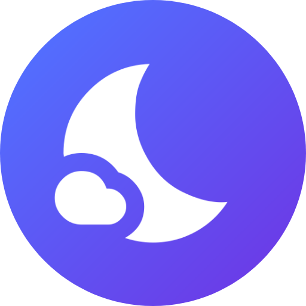
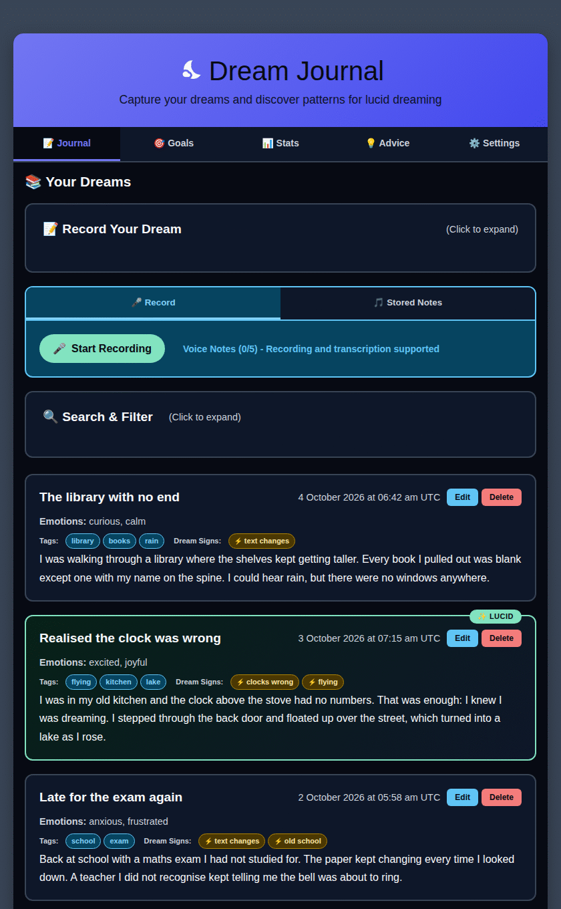
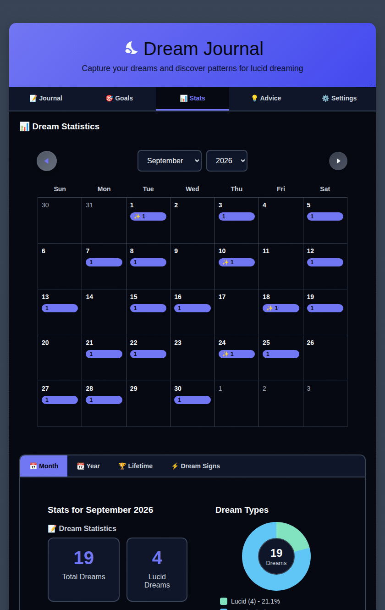
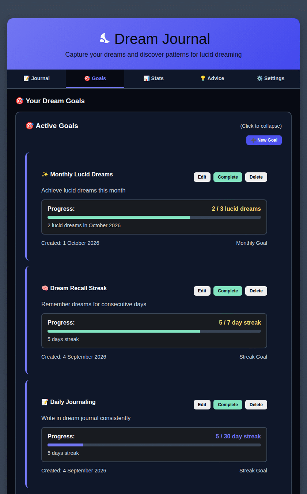
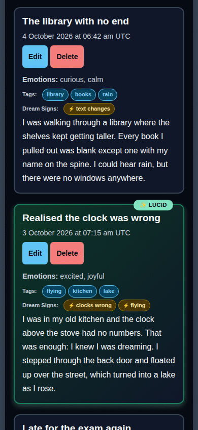
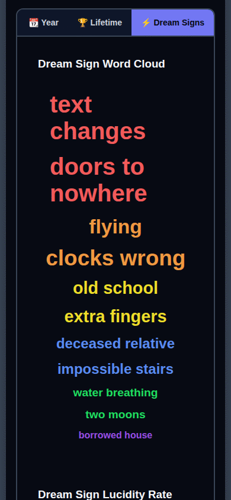
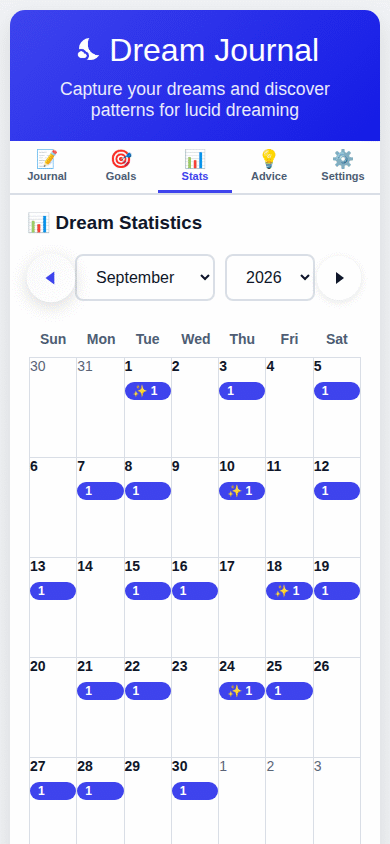

<!-- markdownlint-disable MD033 -->

<p align="center">
  
</p>

<h1 align="center">Dream Journal</h1>

<p align="center">
  <strong>Capture your dreams and discover patterns for lucid dreaming.</strong>
  <br>
  A private dream journal that runs in your browser and keeps your dreams on your device.
  <br>
  <a href="https://webdreamjournal.github.io/DreamJournal/"><strong>Open the app »</strong></a>
</p>

<p align="center">
  <a href="https://github.com/Webdreamjournal/DreamJournal/actions/workflows/test.yml"></a>
  
  
</p>

<p align="center">
  <a href="#features">Features</a> ·
  <a href="#privacy-and-security">Privacy and security</a> ·
  <a href="#install-and-use">Install</a> ·
  <a href="#back-up-your-journal">Backups</a> ·
  <a href="#development">Development</a>
</p>

---

Dream Journal is a Progressive Web App (PWA) for recording dreams and spotting patterns in them, built with lucid dreaming in mind. There is no account, no server component and no analytics. The app is a set of static files, and your journal is stored in your browser, on your own device.

Optional extras (a PIN lock, password encryption and Dropbox backups) are covered in [Privacy and security](#privacy-and-security), including what each one does not protect.

It is written in plain JavaScript (ES modules), HTML and CSS, with no framework and no build step.

<p align="center">
  <a href="screenshots/journal-desktop.png"></a>
  <a href="screenshots/stats-desktop.png"></a>
  <a href="screenshots/goals-desktop.png"></a>
  <br>
  <a href="screenshots/journal-phone.png"></a>
  <a href="screenshots/dream-signs-phone.png"></a>
  <a href="screenshots/stats-light-phone.png"></a>
  <br>
  <sub>Journal, Stats and Goals on desktop (top). Journal, Dream Signs and the light theme on a phone (bottom). The entries shown are made-up sample data.</sub>
</p>

## Features

*   **Dream journal.** Record the date and time, a title, the dream itself, emotions, tags and dream signs (recurring oddities that can tip you off that you are dreaming), and mark whether the dream was lucid. Suggestions appear as you type, and you can manage the suggestion lists in Settings. Press Ctrl+Enter in the description box to save.
*   **Search and filter.** Smart search understands the prefixes `title:`, `content:`, `emotion:`, `tag:` and `sign:`, for example `tag:lucid emotion:happy` or `title:"vacation dream"`. You can also filter to lucid or non-lucid dreams, limit by date range, sort (newest, oldest, lucid first, longest) and choose between pages of 5, 10, 20 or 50, endless scrolling, or everything at once.
*   **Voice notes.** Record a dream by voice as soon as you wake, play it back and download it. Where the browser supports speech recognition, a live transcript is captured while you record and you can turn it into a dream entry. Up to 5 notes are stored at a time. Note that [speech recognition may send your audio off the device](#what-leaves-your-device).
*   **Goals.** Templates for monthly lucid dream targets, dream recall and journalling streaks, and collecting dream signs, plus custom goals that you adjust by hand. Template goals update themselves from your entries.
*   **Statistics.** A calendar of your entries (lucid dreams are marked, and clicking a day jumps to that day's entries), Month, Year and Lifetime summaries, and a lucid versus regular chart. The Dream Signs view shows a word cloud and, for each sign, how often the dreams containing it were lucid.
*   **Advice.** 375 tips in 16 categories (journalling, reality checks, induction techniques such as MILD and WBTB, sleep, recall, dream control, safety and more), a daily tip that you can step through, and short guides to the main techniques.
*   **Import and export.** Complete JSON backups (dreams, goals, settings and suggestion lists), text export and import of dreams, export of only the dreams matching your current filters, and optional password protection for exports.
*   **AI-analysis export.** Tick **Preformatted for AI Analysis** next to **Export Range** on the Journal tab to get a text file with a ready-made prompt and your dreams, to paste into an assistant of your choice. It includes at most 20 dreams (15 if more than 50 match your filters), and the app itself never sends it anywhere.
*   **Dropbox backup (optional).** Upload a backup to your Dropbox and restore it on another device. See [Back up your journal](#back-up-your-journal).
*   **Light and dark themes.** Dark is the default. The layout adapts to phones and desktops.
*   **Accessibility.** Works from the keyboard, announces changes to screen readers through ARIA live regions and keeps focus inside dialogs. An automated axe-core scan of every tab in both themes runs as part of the browser tests.
*   **Installable and offline.** Install it like an app. After your first visit it works without a connection, apart from the features that need one (Dropbox, and speech transcription in some browsers).

## Privacy and security

Your journal stays on your device unless you export it or connect Dropbox. This section describes what the code actually does, including the parts that are less protected than you might assume. Most of the code was written by AI tools and has had little human review (see [About this project](#about-this-project)), so do not rely on it for anything you cannot afford to lose or leak.

### Where your data lives

Dreams, goals, voice notes and suggestion lists are kept in your browser's IndexedDB. Settings, the PIN hash and Dropbox tokens are kept in localStorage. If the browser will not open the database (for example, when site storage is blocked), the app shows a banner and holds entries in memory only, so they are lost when you close the page.

| Data | Encrypted when encryption is on? | In a complete JSON backup? |
| --- | --- | --- |
| Dreams, goals, and tag, dream sign and emotion suggestions | Yes | Yes |
| Voice notes (audio and transcripts) | **No** | No (download them one at a time) |
| Settings (theme, page size, collapsed sections) | No | Theme, page size and the dream form's collapsed state |
| PIN | Not encrypted, but stored only as a salted hash | No |
| Dropbox sign-in tokens | Encrypted, with your journal password or a per-device key | No |
| Connected Dropbox account (name and email) | No | No |

### PIN lock

*   A PIN is 4 to 6 digits, stored as a salted PBKDF2-SHA256 hash.
*   While a PIN is set, the journal locks every time the app opens, and you can lock it yourself from Settings. There is no automatic lock after inactivity.
*   From the third wrong attempt, the app makes you wait 30 seconds. The wait doubles with each further wrong attempt, up to 15 minutes.
*   If you forget it, either enter exactly 3 of your dream titles (they must match exactly, and you need at least 3 titled dreams), or start a 72-hour timer, after which the PIN is removed. The app shows a warning banner with a cancel button while a timer is running.
*   **The PIN is a screen lock, not encryption.** It keeps casual snoopers out of the app, but it does not protect stored data from anyone who can read your browser's storage. Turn on encryption for that.

### Encryption

*   Off by default. When on, dreams, goals and suggestion lists are encrypted with AES-256-GCM, using a key derived from your password with PBKDF2-SHA256 (600,000 iterations) through the browser's Web Crypto API.
*   Your password is not stored. It is held in memory while the journal is unlocked, and a stored check value is used to verify it. Turning encryption on or off, or changing the password, rewrites all stored data in a single database transaction, so a failure part-way does not leave a mix of keys.
*   The password must be at least 8 characters, and a short list of very common passwords is rejected. A long passphrase is still better.
*   **There is no recovery.** If you forget the password, the only option is to wipe the journal ("Forgot Password?" on the lock screen) and restore from a backup.
*   Exports have their own **Password Protected** checkbox, which encrypts that file (as a `.enc` file) with a password you choose for it. That password has no minimum length, so choose a strong one. Exports without the checkbox, and the AI-analysis prompt file, are readable plain text.

### What leaves your device

*   **The app files.** They are served by whichever host you use (GitHub Pages for the link above), which sees ordinary web requests, as any website does. The service worker caches the files for offline use.
*   **The Dropbox SDK.** A script from cdn.jsdelivr.net loads with the page, pinned by an integrity hash. It is a third-party request, but no journal data is sent. If it cannot load (for example, offline), only Dropbox features are unavailable.
*   **Dropbox, only after you connect it.** Sign-in uses OAuth 2.0 with PKCE. The page's content security policy allows connections only to its own origin and the Dropbox API hosts.
*   **Speech transcription.** In browsers that support speech recognition, transcription starts automatically whenever you record a voice note, and there is no setting to turn it off. It uses the browser's built-in recognition. Depending on the browser, that can mean your audio is sent to an online speech service (Chrome does this by default), and the app does not ask for on-device processing. In browsers without speech recognition, recording stays entirely on your device.
*   **Nothing else.** There are no analytics, adverts or error-reporting services.

Imported files and cloud data are treated as untrusted: IDs are validated and text is escaped before it is displayed. A content security policy forbids inline scripts. Automated tests cover both.

## Install and use

1.  Open **[the app](https://webdreamjournal.github.io/DreamJournal/)**. Nothing to sign up for.
2.  Optionally install it. In Chrome or Edge on desktop or Android, use the install icon in the address bar, or the **Install App** button in Settings when it appears. On iPhone or iPad, open the link in Safari, tap Share, then **Add to Home Screen**.
3.  After the first visit it works offline. The service worker fetches fresh files whenever you are online and falls back to its cached copy when you are not.

## Back up your journal

Everything lives in your browser's storage, so clearing site data, resetting or uninstalling the browser, or running out of device storage can delete it. Private windows delete a site's data when they close. The app asks the browser to keep its storage, but browsers decide whether to agree. Safari also deletes a site's data after about a week of Safari use without visiting it, unless the site has been added to the Home Screen.

*   Export a complete backup regularly (**Settings → Data Management → Complete Data Export/Import**) and keep the file somewhere safe. Tick **Password Protected** if the file will be stored anywhere you do not fully control.
*   Voice notes are not part of backups, so download any you want to keep.
*   Importing a JSON backup or a text export merges with what you already have and skips duplicates.

### Dropbox backup (optional)

Connect an account under **Settings → Cloud Sync**.

*   **Upload to Cloud** writes a single backup file (`dream-journal-cloud-sync.json`, or `.enc` when encrypted) to your Dropbox, replacing the previous one. **Download from Cloud** replaces the dreams and goals on the current device with that file's contents.
*   Both are manual. This is backup and restore, not a live two-way merge, so the most recent upload wins. The app warns you before overwriting when it detects that the other side changed since your last sync.
*   Backups in Dropbox are encrypted only when journal encryption is on and **Encrypt cloud backups** is ticked (it is by default). Otherwise the file is readable JSON containing all your dreams and goals.
*   The app ships with a default Dropbox app key. If you host a copy at another address, create your own Dropbox app, register your address as a redirect URI, and enter its key in the advanced options under **Settings → Cloud Sync**.

## Browser support and limitations

*   You need a current browser with ES modules, IndexedDB, Web Crypto and service worker support, served over HTTPS (or from `localhost`).
*   The automated browser tests run in Chromium only. The code handles Firefox and Safari differences in voice recording, but those browsers are not covered by the automated tests.
*   Voice notes need microphone permission. Only 5 can be stored at a time, they are not encrypted, and they are not included in backups.
*   Transcription is experimental and English (US) only. Support depends on the browser, and the app warns that it is unreliable on mobile. Settings shows what your browser supports. See [What leaves your device](#what-leaves-your-device) for the privacy side.
*   A monthly goal counts the month it was created in, so create a new one each month.
*   Dropbox sync is a manual backup and restore, as described above. There is no automatic or live sync between devices.

## Development

Everything is static, so you can run it from a plain file server:

```sh
git clone https://github.com/Webdreamjournal/DreamJournal.git
cd DreamJournal
python3 -m http.server 8000   # then open http://localhost:8000
```

The checks need Node 20 or newer:

```sh
npm install
npm run lint             # ESLint, correctness rules only
npm test                 # node:test suites in tests/*.test.js, no browser needed
npm run test:e2e         # Playwright tests in tests/e2e/ (needs Chromium)
npm run qa:screenshots   # screenshots of every tab into qa-screenshots/
```

Set `CHROMIUM_PATH` to use an installed Chromium for the browser tests and the screenshots. CI (`.github/workflows/test.yml`) runs lint, the unit tests and the browser tests on pushes to `main` and on pull requests.

*   The unit tests cover encryption and key derivation, the encryption check value, PIN lockout, import sanitising and escaping, the content security policy, module exports and loading, element ids used by the code, action routing, version consistency and the service worker's precache list.
*   The browser tests cover startup, the journal, goals, import and export, locking and recovery, storage failures, voice notes, layout, performance, and accessibility (axe on every tab in both themes).

### Project layout

All modules sit flat in the repository root. `src/app.js` is only the entry point.

| Path | Role |
| --- | --- |
| `index.html` | Static shell. The tab panels are rendered by JavaScript. |
| `main.js`, `action-router.js`, `state.js` | Startup order and lock state, event delegation through `data-action`, and shared state. |
| `storage.js`, `storage-banner.js` | IndexedDB and localStorage access, and the storage problem banner. |
| `security*.js`, `pin-*.js`, `encryption-*.js`, `lock-screen.js` | Cryptography, the PIN, encryption settings, recovery and the lock screen. |
| `*tab.js`, `dream-crud.js`, `voice-notes.js`, `dom-helpers.js` | The interface: tab rendering, dreams, voice notes, and the UI modules that `dom-helpers.js` re-exports. |
| `import-export.js`, `cloud-sync.js`, `device-key.js` | Backups, Dropbox sync and token storage. |
| `sw.js`, `pwa.js`, `manifest.json` | Offline support and installation. |
| `tests/` | Unit tests (`*.test.js`) and Playwright tests (`e2e/`). |

[`AGENTS.md`](AGENTS.md) has the full module table and the rules that have caused bugs here (for example read-only imports, escaping untrusted strings, no inline event handlers, and keeping the version and the service worker's precache list in step). Read it before changing code.

### Debug logging

Diagnostics are silent by default. To see them, run `localStorage.setItem('dreamJournalDebug', 'true')` in the browser console and reload. `console.warn` and `console.error` always print.

### Releasing

Bump `APP_VERSION` in `version.js`, then update the README badge, the `index.html` footer and `CACHE_NAME` in `sw.js` to match. `npm test` fails if they drift.

### Hosting your own copy

Serve the repository root from any static host over HTTPS. There is nothing to build. Dropbox sync needs your own app key at a different address (see [Dropbox backup](#dropbox-backup-optional)).

## About this project

Almost all of the code was written by AI tools, mainly Claude Code and Jules, and has had little human review. The lint, unit test and browser test suites, which run in CI, are the main safety net. Keep that in mind before trusting the PIN or encryption with anything important, and keep your own backups.

## Licence

Distributed under the GNU Affero General Public License v3.0. See [`LICENSE`](LICENSE) for the full text. Under the AGPL, if you offer a modified version to others over a network, you must also make its source available to those users.

## Disclaimer

Dream Journal is for entertainment and personal journalling only. It does not provide medical, psychological or therapeutic advice. If you have concerns about your sleep, dreams or mental health, please consult a qualified healthcare professional.
